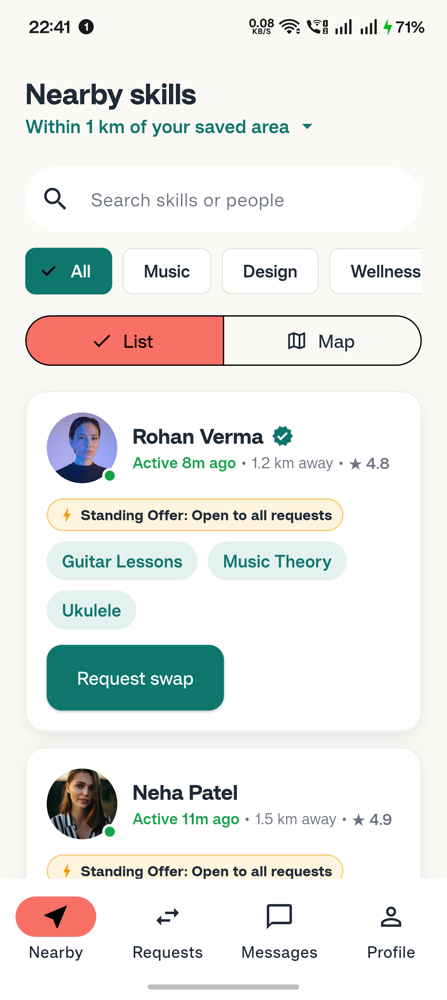
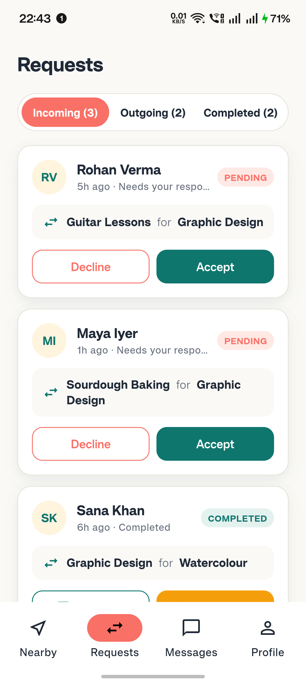
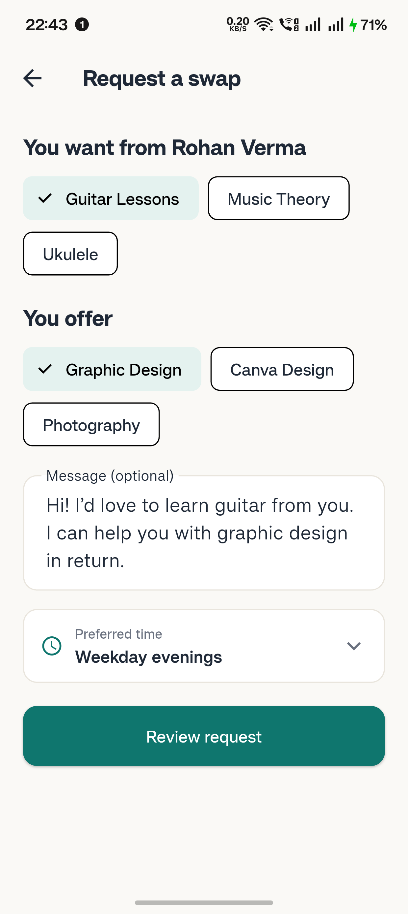
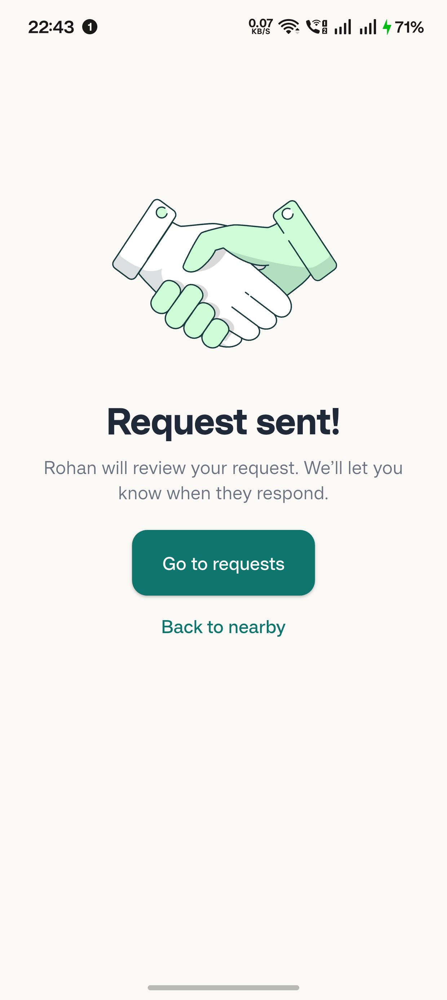

# 🤝 SkillNearby — Local Skill-Swapping Community App

[](https://flutter.dev)
[](https://riverpod.dev)
[](https://drift.simonbinder.eu)
[](https://supabase.com)
[](LICENSE)

**SkillNearby** is a local-first, community-driven mobile platform that connects neighbours within walking distance to trade real-world skills — from acoustic guitar, French conversation, and sourdough baking to Flutter development, yoga, and portrait photography — with **zero money exchanged**.

---

## 📱 App Showcase & Screenshots

| 🏡 Neighbourhood Feed & Vector Map | 📊 Requests & Standing Offers | 💬 Realtime Chat & Exchanges | 👤 Dynamic Dark/Light Theme Profile |
| :---: | :---: | :---: | :---: |
|  |  |  |  |

---

## ✨ Key Features

### 🏡 Neighbourhood Radar & Vector Map
- **Custom Vector Map Canvas**: Interactive neighbourhood canvas displaying local skill providers with live distance markers.
- **Distance & Category Filters**: Filter by sub-5km radius and categories (*Music, Languages, Tech, Cooking, Wellness, Design*).

### 🤝 Seamless Skill Swapping Workflows
- **Interactive Swap Requests**: Submit requests with preferred times and custom swap proposals.
- **Lottie Handshake Animation**: Smooth visual confirmation on request submission.
- **Accept, Decline & Undo**: Accept or decline incoming requests; undo accidental accepts directly from the incoming feed.
- **Standing Offers**: Post open community offers for ongoing neighbour requests.

### 🌗 Adaptive Dual Theme System
- **Custom Warm Dark Theme**: Tailored design system based on `#0F1513` base background, `#1D2622` surface cards, `#4FC3AE` bright teal primary, and `#F2895F` coral accent.
- **Dynamic Chrome & Status Bar**: Automatic `SystemChrome.setSystemUIOverlayStyle()` switching for optimal status bar and navigation bar contrast.

### ⚡ Local-First & Supabase Realtime Architecture
- **Drift SQLite Storage**: Instant offline read/write capabilities with background FIFO outbox queueing.
- **Supabase Realtime Sync**: WebSocket channel subscriptions on `public:swaps` and `public:messages` for instant cross-device updates.
- **Persistent Preferences**: Profile data & theme mode saved locally using Hive.

### 🔔 Push Notifications
- Integrated `flutter_local_notifications` for instant alerts when a neighbour accepts a skill swap request.
- Interactive debug notification testing tool included in Profile Settings.

### 📸 Native Profile & Gallery Media
- **Gallery Image Picker**: Add custom profile images directly from native device gallery (`image_picker`).
- **Verified Neighbour Badges**: Multi-tier community trust verification (Phone, ID, Rating).
- **Expandable Profile Cards**: Tap any profile card to inspect bio, offered/wanted skills, response rate, and rating breakdowns.

---

## 🛠️ Technology Stack

| Layer | Technology |
| :--- | :--- |
| **Framework** | Flutter (Dart 3.x) |
| **State Management** | Flutter Riverpod 3.0 |
| **Local Database** | Drift (SQLite) & Hive |
| **Backend & Realtime** | Supabase (Postgres RPC, PostGIS, Realtime WebSockets) |
| **Routing** | GoRouter 17.x |
| **Local Alerts** | `flutter_local_notifications` |
| **Animations** | Lottie 3.5 |
| **Media Picker** | `image_picker` 1.1 |

---

## 🚀 Getting Started

### Prerequisites
- Flutter SDK (3.x or higher)
- Android Studio / VS Code with Flutter extension
- An Android virtual device or physical device

### Installation Steps

1. **Clone the repository**:
   ```bash
   git clone https://github.com/YourUsername/SkillNearby.git
   cd SkillNearby
   ```

2. **Install dependencies**:
   ```bash
   flutter pub get
   ```

3. **Run Static Analysis & Tests**:
   ```bash
   dart analyze
   flutter test
   ```

4. **Launch the application**:
   ```bash
   flutter run
   ```

---

## 🧪 Testing & Developer Tools

Inside **Profile -> Developer / Debug Mode**, you can test platform features directly:
- **`🔔 Test Push Notification Alert`**: Triggers a sample local swap acceptance notification.
- **`⚡ Test Supabase Realtime Sync`**: Tests WebSocket stream connection on `public:swaps` & `public:messages`.
- **`🖼️ View 13 Empty Illustrations Gallery`**: Preview zero-state vector illustrations for offline, search, and empty request feeds.

---

## 📄 License

This project is licensed under the MIT License - see the [LICENSE](LICENSE) file for details.
